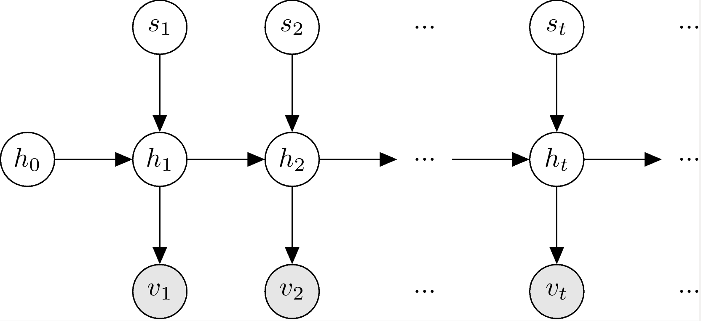

# Bayesian Change Point Model (BCPM)

BCPM is a hierarchical probability model, more precisely a hidden Markov model, that relates observed features to hidden variables. More specifically, the model tracks a set of latent variables and generates a signal in case of a *change*. The typical applications of BCPM are those in which sudden bursts in temporal data are aimed to be detected.  

# Folders

### **jupyter-nb**
Contains two jupyter notebooks: 
 * **Bayesian_Change_Point_Model.ipynb** is the one in which we explain the model and inference in general, and give two model specifications. You can also find experiments on synthetic data and two well-known data sets (coal mining and well-log)
 * **BCPM_Implementation.ipynb** contains the implementation in python3.5.

### **cpp**
The C++ implementation of BCPM stays here. Under that folder, we have:
 * **include**: The implementation itself. **bcpm.hpp** is the generic implementation of the model, inference and parameter learning algorithms. Model specifications, i.e., implementations of different reset and observation models, are also in this folder. You may add new models just by creating a header similar to __bcpm_*.hpp__ in this folder.
 * **test**: All test cases reside here. All of them must pass after successful installation and compilation procedure.
 * **visualize**: python3.5 scripts to visualize model inputs/outputs. 
 * **compile**: Compilation script.
 * **CMakeLists.txt**: CMake file for compilation

### **etc**
Contains the experimental data and the drawing of the graphical model.

# Compiling and Running
 * You must be able to run jupyter notebooks with python3.5 and necessary libraries installed (see the notebook for libraries)
 * In order to run C++ code, you must first install [pml](https://github.com/pilab-sigma/pml) in order to run C++ code. The library is header-only, meaning you can import it in a single line: `#include "bcpm.hpp"`. See the test files for example usage.
